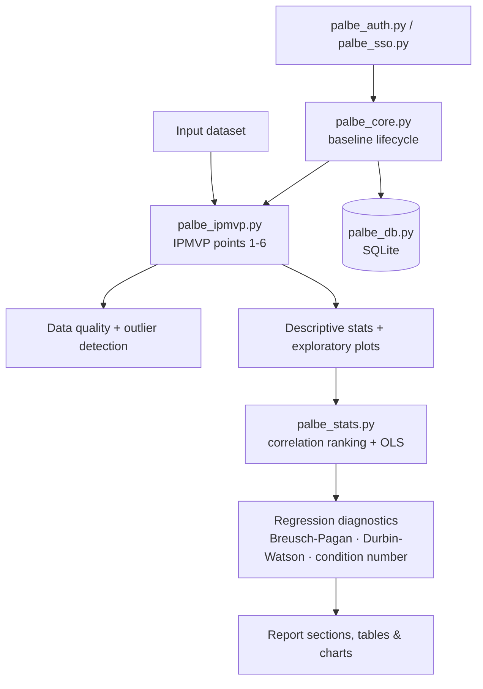

# Baseline & Trend Analysis (IPMVP)

> Statistical engine for building energy-consumption baselines, tracking their evolution, and
> verifying savings against the **IPMVP** protocol (International Performance Measurement and
> Verification Protocol) — regression diagnostics, outlier handling, and automated reporting.

<p align="center">
  
  
  
  
</p>

> This is an anonymized, backend-only extract of one module from a larger internal platform I
> built at an engineering company. **No UI code is included** — only the statistical engine, the
> data layer, and the auth/integration logic. Company-specific references have been removed.

## Problem → Solution → Result

**Problem.** IPMVP savings verification requires building a statistically sound regression
baseline (energy use vs. the independent variables that drive it — weather, production,
occupancy...), checking it actually meets the protocol's own validity requirements (normality,
homoscedasticity, no excessive multicollinearity), and documenting all of that defensibly. Doing
this by hand in notebooks each time doesn't scale across sites and doesn't leave a repeatable
audit trail.

**Solution.** A library that automates the IPMVP's first six analysis points — data quality
checks, descriptive statistics, exploratory plots, independent-variable identification,
correlation ranking, and outlier detection — then fits and validates an OLS regression with
k-fold cross-validation, and runs the standard diagnostic battery (Breusch-Pagan for
heteroscedasticity, Durbin-Watson for autocorrelation, condition number for multicollinearity,
Q-Q plots for residual normality) before the baseline is accepted.

**Result.** What used to be a manual, notebook-by-notebook process became a reusable pipeline:
feed it a dataset and a target variable, get back a ranked set of candidate predictors, a
validated regression with its full diagnostic report, and the generated charts — ready to drop
into a Word report.

---

## Architecture



- **`palbe_ipmvp.py`** — the IPMVP preliminary-analysis engine: dataset quality scoring,
  frequency/period detection, descriptive statistics, independent-variable candidates, and
  outlier flagging, each producing a report section with its own table and chart.
- **`palbe_stats.py`** — Pearson correlation ranking against candidate predictors, then an OLS
  fit with train/test split, k-fold cross-validation, and the full diagnostic battery
  (heteroscedasticity, autocorrelation, multicollinearity, residual normality), each with a
  significance read-out.
- **`palbe_core.py`** — the baseline lifecycle: versions, acceptance state, and the glue between
  the statistical engine and persistence.
- **`palbe_db.py`** — SQLite access layer, with explicit tests enforcing that the database path
  is configurable and never collocated with the code (`tests/test_db_path_isolation.py`).
- **`palbe_auth.py` / `palbe_sso.py` / `link_sso.py`** — two entry paths: a local login and an
  OIDC/SSO integration (linking an external identity to a local user), each independently
  disable-able.

### Key design decisions

| Decision | Why |
|---|---|
| **IPMVP as code, not a notebook template** | The protocol's six preliminary steps are the same for every analysis — encoding them as a reusable module means every baseline gets the same rigor, not whatever the analyst remembered to check |
| **Full diagnostic battery before acceptance** | A regression with a good R² but failing residual normality or showing strong heteroscedasticity isn't a valid IPMVP baseline — these checks are mandatory output, not optional extras |
| **Combined outlier criterion** | A single method (e.g. IQR alone) misses different failure patterns than a Z-score or residual-based method; combining them catches more while reporting which criterion flagged each point |
| **DB path configurable and isolated** | A monolithic FastAPI app is easy to accidentally let write its database next to the code; dedicated tests fail the build if that happens |
| **Two independent auth paths** | The tool needs to work both standalone and embedded in a larger platform's SSO; each path can be disabled via a single flag without touching the other |

---

## Stack

Python 3.11+ · pandas / numpy · scikit-learn (cross-validation, scaling) · statsmodels (OLS,
Breusch-Pagan) · scipy.stats · Plotly (charts, rendered to PNG via kaleido for reports) · FastAPI
· SQLite

## What's deliberately not here

- **No UI.** The original tool has a FastAPI front-end (templates + JS); only the statistical
  and data-access logic is published here.
- **No `app_palbe_4.py`.** The original's route-wiring file is a ~9,000-line legacy monolith
  that the internal roadmap already plans to replace with a restructured version — including it
  verbatim would add bulk without adding signal. The business logic lives in the modules above.
- **No production SSO configuration or real deployment secrets.**

## Known trade-offs (kept honest)

The original module is explicitly frozen for only-corrections maintenance ahead of a rewrite —
`ruff` reports several hundred lint findings against current project style, tracked as accepted
technical debt rather than fixed in place, since the module is being replaced rather than
refactored. I'm including this here rather than hiding it: knowing when *not* to refactor a
module you're about to retire is itself a judgment call.

## Tests

```bash
uv sync
uv run pytest
```

Covers: DB path isolation, SSO linking, IDOR checks on project/report access, visibility rules,
and route removal regressions.

## License

MIT — see [LICENSE](LICENSE). Anonymized, backend-only portfolio extract; not the original
production repository.
